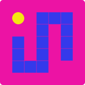

````markdown
# Hi, Welcome to the documentation of my SnakeGame 🐍. I ma Ferdus Rhaman Khan and this is my obsession over little details in simple things.
````
<p align="center">
  
</p>


# 🐍 Snake Game — Technical Documentation

## 📘 Overview

This project is a **browser-based Snake Game** built with **HTML5 Canvas**, **JavaScript**, and **CSS**. It uses keyboard and on-screen controls to move the snake, detect collisions, update scores, and manage start, pause, and reset states.

This document explains the **full system architecture**, **code decisions**, and **logic flow** — with **visual diagrams** to help learners understand every design aspect.

---

## 🧩 Project Structure

```bash
snake-game/
│
├── index.html        # Structure and layout of the game UI
├── style.css         # Visual styles for the board, buttons, and typography
└── game.js           # All JavaScript logic controlling the game
````

-----

## 🖼️ index.html — Structure and Purpose

### Key Components

| Element                             | Purpose                                     |
|-------------------------------------|---------------------------------------------|
| `<canvas>`                          | The drawing surface for the snake and apple |
| `<span id="score">`                 | Displays the player's score                 |
| `Start`, `Pause`, `Reset` Buttons   | Control the game loop                       |
| Directional Buttons                 | Allow touch/mouse input for movement        |

### HTML Snippet

```html
<canvas id="gameBoard" width="600" height="600"></canvas>
<span id="score">Score: 0</span>
<div class="btns">
  <button id="startBtn">Start Game</button>
  <button id="pauseBtn">Pause Game</button>
  <button id="resetBtn">Reset Game</button>
</div>
```

### Why Canvas?

Canvas gives **pixel-level control** and **real-time rendering** — unlike standard HTML elements, which reflow with the DOM.

-----

## 🎨 Game Initialization (game.js)

### Canvas & Context

```js
const canvas = document.getElementById("gameBoard");
const ctx = canvas.getContext("2d");
```

`ctx` is the **2D rendering context** — the "pen" that draws shapes, lines, and fills on the "paper" (canvas).

-----

## ⚙️ Game Configuration

```js
let direction = "RIGHT";
let speed = 100;
let scoreCount = 0;
let gameLoop;
let isGameStarted = false;
let isPaused = false;
```

| Variable                    | Role                              |
| --------------------------- | --------------------------------- |
| `direction`                 | Current movement direction        |
| `speed`                     | Frame interval (ms)               |
| `scoreCount`                | Tracks total score                |
| `gameLoop`                  | Holds `setInterval()` reference   |
| `isGameStarted`, `isPaused` | Boolean flags for game state      |

-----

## 🧱 Grid System and Snake Representation

### Grid Design

Each cell (or tile) is 20px $\times$ 20px. For a 600$\times$600 canvas, there are **30 columns $\times$ 30 rows**.

```js
const tileSize = 20;
const gap = 1;
const segmentSize = tileSize - gap * 2;
```

This ensures all snake movements align perfectly to the grid.

### Grid Visualization

```
+-----------------------------+
| [0,0] [1,0] [2,0] ... [29,0]|
| [0,1] [1,1] [2,1] ... [29,1]|
|  ...                       |
| [0,29] ...          [29,29]|
+-----------------------------+
```

Each cell represents a coordinate multiple of `tileSize`.

-----

## 🐍 Snake Initialization

```js
const snake = [
  { x: 15 * tileSize, y: 15 * tileSize },
  { x: 14 * tileSize, y: 15 * tileSize },
  { x: 13 * tileSize, y: 15 * tileSize },
];
```

### Structure Visualization

```
Head → ■ ■ ■ ← Tail
(x=15,15) (x=14,15) (x=13,15)
```

Each segment is an `{x, y}` object representing a grid position.

-----

## 🍎 Apple Mechanics

### Random Placement

```js
const applePosition = () => {
  const posX = Math.floor((Math.random() * canvas.width) / tileSize);
  const posY = Math.floor((Math.random() * canvas.height) / tileSize);
  return { x: posX * tileSize, y: posY * tileSize };
};
```

### Why Multiply by `tileSize`?

Ensures the apple always aligns to grid cells rather than random pixels.

-----

### Drawing the Apple

```js
const drawApple = () => {
  const centerX = apple.x + tileSize / 2;
  const centerY = apple.y + tileSize / 2;
  const radius = segmentSize / 2;

  ctx.fillStyle = "#f5e612";
  ctx.beginPath();
  ctx.arc(centerX, centerY, radius, 0, Math.PI * 2);
  ctx.fill();
};
```

**Design Choice:** A circular apple improves visual contrast with the square snake.

-----

## 🟩 Snake Rendering

```js
const drawSnake = () => {
  snake.forEach((segment, index) => {
    ctx.fillStyle = index === 0 ? "#f5e612" : "#341bef";
    ctx.fillRect(segment.x, segment.y, segmentSize, segmentSize);
  });
};
```

  * **Head (yellow):** Distinguishes direction.
  * **Body (purple):** Maintains visual consistency.

-----

## 🧭 Movement Logic

```js
const moveSnake = () => {
  const head = { ...snake[0] };

  switch (direction) {
    case "RIGHT": head.x += tileSize; break;
    case "LEFT": head.x -= tileSize; break;
    case "UP": head.y -= tileSize; break;
    case "DOWN": head.y += tileSize; break;
  }

  // Wrap-around logic
  if (head.x >= canvas.width) head.x = 0;
  if (head.x < 0) head.x = canvas.width - tileSize;
  if (head.y >= canvas.height) head.y = 0;
  if (head.y < 0) head.y = canvas.height - tileSize;

  snake.unshift(head);

  if (head.x === apple.x && head.y === apple.y) {
    apple = applePosition();
    updateScore();
  } else {
    snake.pop();
  }
};
```

### 🌀 Wrap-Around Visualization

```
← Left Edge ───────────────────────────── Right Edge →
  If snake crosses → reappears on opposite side
```

This design keeps gameplay continuous rather than ending on wall collision.

-----

## ⚠️ Collision Detection

```js
const collisionDetection = () => {
  const head = snake[0];
  for (let i = 1; i < snake.length; i++) {
    if (head.x === snake[i].x && head.y === snake[i].y) return true;
  }
};
```

Detects self-collision (when the head touches any body part).

### Collision Concept Diagram

```
[H] [B] [B] [B]
 ↑
 Head overlaps body → Collision detected
```

-----

## ⌨️ Input Controls

### Keyboard Mapping

```js
const changeDirection = (e) => {
  const key = e.key.toLowerCase();

  if ((key === "arrowleft" || key === "a") && direction !== "RIGHT") direction = "LEFT";
  else if ((key === "arrowright" || key === "d") && direction !== "LEFT") direction = "RIGHT";
  else if ((key === "arrowup" || key === "w") && direction !== "DOWN") direction = "UP";
  else if ((key === "arrowdown" || key === "s") && direction !== "UP") direction = "DOWN";

  if (e.code === "Space") pauseGame();
  if (key === "enter") gameStart();
};
```

### Design Reasoning

| Key                   | Action         |
| --------------------- | -------------- |
| `Arrow Keys` / `WASD` | Movement       |
| `Space`               | Pause / Resume |
| `Enter`               | Start Game     |

These bindings mimic classic game controls for intuitiveness.

-----

## 📱 On-Screen Controls

Mobile buttons use `addEventListener("click")` to mirror the same movement logic. This ensures full accessibility on touch devices.

-----

## 🧮 Score Management

```js
const updateScore = () => {
  scoreCount++;
  score.textContent = `Score: ${scoreCount}`;
};
```

### Why Use `textContent`?

It updates DOM elements efficiently without re-rendering the entire interface.

-----

## 🕹️ Game Flow Diagram

Below is a high-level **flowchart** of the game logic:

```
        ┌──────────────────┐
        │   Start Screen   │
        └───────┬──────────┘
                │ (Enter)
                ▼
          ┌───────────────┐
          │  Game Running │
          └──────┬────────┘
                 │
        ┌───────┴──────────────┐
        │  Pause (Space Key)   │
        │  Resume (Space Key)  │
        └────────┬─────────────┘
                 │
        ┌────────▼───────────┐
        │   Collision?       │
        │  (Self Hit Check)  │
        └────────┬───────────┘
                 │ Yes
                 ▼
          ┌────────────────┐
          │   Game Over    │
          └────────────────┘
```

-----

## ⏯️ Managing Game States

### Start Game

```js
const gameStart = () => {
  isGameStarted = true;
  clearInterval(gameLoop);
  gameLoop = setInterval(drawGame, speed);
};
```

### Pause / Resume Game

```js
const pauseGame = () => {
  if (isGameStarted) {
    isPaused = !isPaused;
    pauseBtn.textContent = isPaused ? "Resume Game" : "Pause Game";
  }
};
```

### Reset Game

```js
const resetGame = () => {
  snake.length = 0;
  snake.push(
    { x: 15 * tileSize, y: 15 * tileSize },
    { x: 14 * tileSize, y: 15 * tileSize },
    { x: 13 * tileSize, y: 15 * tileSize }
  );
  direction = "RIGHT";
  scoreCount = 0;
  score.textContent = "Score: 0";
  clearInterval(gameLoop);
  gameLoop = setInterval(drawGame, speed);
};
```

-----

## 💀 Game Over Screen

When collision occurs:

```js
function gameOver() {
  clearInterval(gameLoop);
  ctx.fillStyle = "rgba(236, 19, 164, 1)";
  ctx.fillRect(0, 0, canvas.width, canvas.height);
  ctx.fillStyle = "white";
  ctx.font = "40px Tiny5";
  ctx.textAlign = "center";
  ctx.fillText("GAME OVER", canvas.width / 2, canvas.height / 2);
}
```

### Visual Representation

```
+----------------------------------+
|          GAME OVER               |
|      Please restart the game!    |
+----------------------------------+
```

-----

## 🧠 Design Principles

1.  **Simplicity:** Pure JS, minimal external code.
2.  **Readability:** Modular functions, clear naming.
3.  **Scalability:** Easily extendable (levels, obstacles, sounds).
4.  **Accessibility:** Keyboard + on-screen support.
5.  **Continuous Feedback:** Real-time score, smooth motion, pause overlay.

-----

## 🪄 Possible Enhancements

  * 🧱 Add obstacles or walls.
  * 🚀 Increase difficulty as the snake grows.
  * 💾 Save high scores in `localStorage`.
  * 🔊 Add sound effects.
  * 🌈 Power-ups with different colors and effects.

-----

## 🏁 Conclusion

This Snake Game showcases **core concepts of JavaScript game development** using the Canvas API:

  * Frame-based rendering
  * Grid logic
  * Collision detection
  * State management
  * Keyboard/mouse interactivity

It’s a **foundation-level example** that can be expanded into advanced arcade-style games.

-----

## 📊 Summary Diagram — Full Game Lifecycle

```
    ┌───────────────┐
    │  Initialization│
    └──────┬────────┘
           │
           ▼
    ┌──────────────┐
    │ Start Screen │
    └──────┬───────┘
           │ (Enter)
           ▼
    ┌──────────────┐
    │ Main Loop    │
    │ drawGame()   │
    └──────┬───────┘
           │
    ┌──────▼─────────┐
    │ Collision Check│
    └──────┬─────────┘
           │Yes
           ▼
    ┌───────────────┐
    │  Game Over    │
    └──────┬────────┘
           │Reset/Start
           ▼
    ┌───────────────┐
    │ Restart Loop  │
    └───────────────┘
```

```
```
